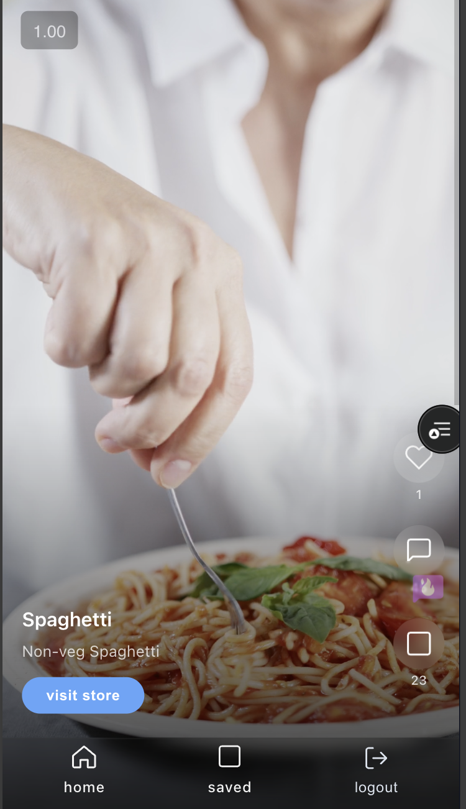
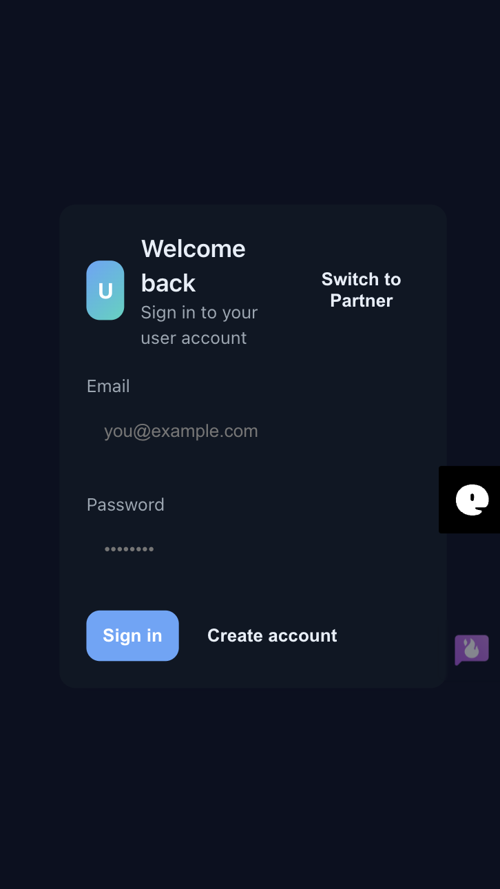
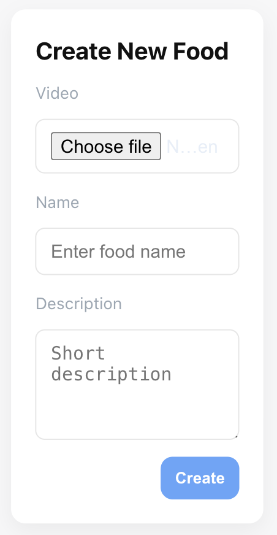

<div align="center">
  
# 🍽️ Zomato-II

**The Next Generation Food Discovery & Partner Platform**
A full-stack MERN application connecting food lovers with partner restaurants, featuring a video-first food feed, seamless role-based authentication, and interactive culinary discovery.

[](https://zomato-sable-delta.vercel.app)

</div>

---

## ✨ Key Features

- **🍔 Dual Authentication System:** Secure and distinct login/registration workflows for Users and Food Partners using JWT.
- **📸 Video-First Food Feed:** Food partners can upload high-quality food videos natively processed via `multer` and hosted on `ImageKit`.
- **❤️ Interactive Discovery:** Users can explore the feed, like their favorite dishes, and view dedicated partner profiles.
- **🏪 Food Partner Dashboard:** Dedicated portal for restaurant partners to create and manage their food listings.
- **🔒 Protected Routing:** Frontend navigation secured against unauthorized access depending on user roles (User vs Partner).

---

## 🛠️ Technologies Used

### Frontend


### Backend


### Database & Storage


---

## 🏗️ Architecture / How it Works

1. **Client Layer (React + Vite):** The frontend consists of separate portals tailored for consumers and food partners. React Router enforces access control via context-aware protected routes.
2. **API Communication:** Axios manages HTTP requests, securely attaching cookie-based JWT credentials to authenticate all sensitive operations seamlessly.
3. **Application Server (Node.js + Express):** The backend serves RESTful endpoints and validates tokens in the middleware layer.
4. **Media & Data Persistence:** Raw video/image payloads are intercepted via `multer`, streamed directly to ImageKit, and their optimized URLs, along with application state, are saved into isolated `MongoDB` collections.

---

## 📸 Visuals & Previews

### 1. Application Dashboard & Feed


_Discover a curated feed of dishes submitted by partners._

### 2. Login / Authentication Gateway


_Secure role-based entry point for standard users and verified partners._

### 3. Food Partner Profile View


_Detailed catalog showcasing partner offerings and likes._

_(Note: Adjust the captions above as necessary to perfectly match the visible screens)_

---

## 🚀 Installation & Setup

### Prerequisites

- [Node.js](https://nodejs.org/) installed
- [MongoDB](https://www.mongodb.com/) instance running
- [ImageKit](https://imagekit.io/) account for media uploads

### 1. Clone the Repository

```bash
git clone https://github.com/lakshay909/Zomato-II.git
cd Zomato-II
```

### 2. Backend Setup

```bash
cd backend
npm install
```

Create a `.env` file in the `backend` directory:

```env
PORT=3000
MONGODB_URI=your_mongodb_connection_string
JWT_SECRET=your_jwt_secret_key
# ImageKit Config
IMAGEKIT_PUBLIC_KEY=your_imagekit_public_key
IMAGEKIT_PRIVATE_KEY=your_imagekit_private_key
IMAGEKIT_URL_ENDPOINT=your_imagekit_url_endpoint
```

Start the backend server:

```bash
node server.js
```

### 3. Frontend Setup

Open a new terminal and navigate to the frontend folder:

```bash
cd frontend
npm install
```

Create a `.env` file in the `frontend` directory:

```env
VITE_API_BASE_URL=http://localhost:3000
```

Start the Vite development server:

```bash
npm run dev
```

---

## 📡 API Endpoints

### 🔐 Authentication

| Method | Endpoint                         | Description             |
| ------ | -------------------------------- | ----------------------- |
| `POST` | `/api/auth/user/register`        | Register a new user     |
| `POST` | `/api/auth/user/login`           | Login as user           |
| `GET`  | `/api/auth/user/logout`          | Logout user             |
| `POST` | `/api/auth/foodPartner/register` | Register a food partner |
| `POST` | `/api/auth/foodPartner/login`    | Login as food partner   |
| `GET`  | `/api/auth/foodPartner/logout`   | Logout food partner     |

### 🍔 Food Operations

| Method | Endpoint                 | Description                            |
| ------ | ------------------------ | -------------------------------------- |
| `POST` | `/api/food/`             | Create new food listing (Partner only) |
| `GET`  | `/api/food/`             | Retrieve food feed                     |
| `POST` | `/api/food/:foodId/like` | Toggle like status on a food item      |

### 🏪 Food Partner Profiles

| Method | Endpoint                             | Description                             |
| ------ | ------------------------------------ | --------------------------------------- |
| `GET`  | `/api/food-partner/food-partner/:id` | Fetch public profile for a food partner |

---

## 🤝 Contributing

Contributions are always welcome!

1. Fork the Project
2. Create your Feature Branch (`git checkout -b feature/AmazingFeature`)
3. Commit your Changes (`git commit -m 'Add some AmazingFeature'`)
4. Push to the Branch (`git push origin feature/AmazingFeature`)
5. Open a Pull Request

---

## 📝 License

Distributed under the MIT License. See `LICENSE` for more information.

---

## 📫 Contact

**Lakshay Narula** - [GitHub Profile](https://github.com/lakshay909) - lakshay.narula.dev@gmail.com

Project Link: [https://github.com/lakshay909/Zomato-II](https://github.com/lakshay909/Zomato-II)
